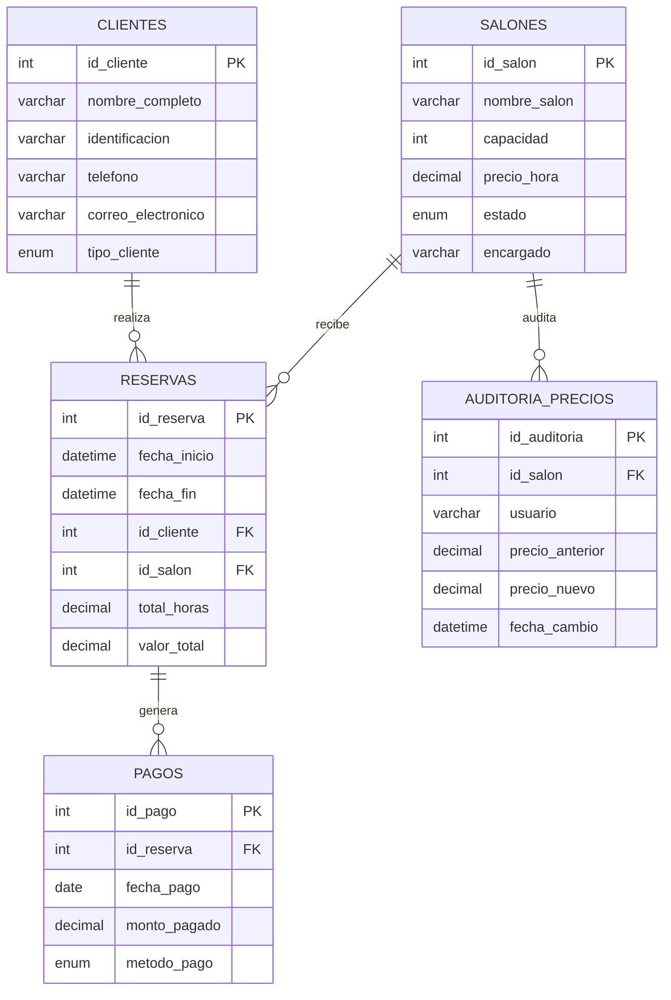

# Sistema de Reservas de Salones de Eventos — Eventos Premier S.A.S.

## 1. Descripción del proyecto

Eventos Premier S.A.S. alquila salones para reuniones, fiestas y conferencias.
Este proyecto digitaliza la gestión de reservas en **MySQL 8.x** (probado
también en **MariaDB 10.11**), cubriendo salones, clientes, reservas y pagos,
con funciones, triggers y vistas que permiten al personal administrativo
controlar disponibilidad, ingresos y mantenimiento.

## 2. Modelo entidad-relación




## 3. Estructura de archivos (organización sugerida del repositorio)

```
reservas-salones-eventos/
├── database.sql
├── functions.sql
├── triggers.sql
├── views_and_queries.sql
├── README.md
└── .gitignore
```

## 4. Instrucciones de ejecución

**Orden obligatorio** (cada script depende del anterior: las funciones se
usan dentro de los triggers, y los triggers deben existir antes de insertar
reservas nuevas):

```bash
mysql -u root -p < database.sql
mysql -u root -p < functions.sql
mysql -u root -p < triggers.sql
mysql -u root -p < views_and_queries.sql
```

Los datos de prueba de `database.sql` se insertan **antes** de que exista el
trigger que calcula `total_horas`/`valor_total` automáticamente (ese trigger
solo aplica a `INSERT`s futuros). Por eso `triggers.sql` incluye, justo
después de crear `tr_calcular_totales_reserva`, un `UPDATE` de respaldo que
recalcula esos campos una sola vez para dejar los datos semilla consistentes.
Cualquier reserva nueva que insertes después ya se calcula sola.


## 5. Funciones

### `calcular_total_reserva(precio_hora, horas)`
Retorna `precio_hora * horas * 1.19` (IVA del 19%). Es pura aritmética, sin
consultas — se usa tanto desde el trigger de reservas como de forma manual.

```sql
SELECT calcular_total_reserva(150000.00, 4); -- 714000.00
```

### `verificar_disponibilidad(salon_id, fecha_inicio, fecha_fin)`
Retorna `1` si el salón está disponible, `0` si no. Un salón se considera
**no disponible** si:
- su `estado` es `'En mantenimiento'`, **o**
- ya existe una reserva que se solapa con el rango pedido (solapamiento
  clásico: `inicio_existente < fin_nuevo AND fin_existente > inicio_nuevo`).

```sql
SELECT verificar_disponibilidad(1, '2026-09-05 10:00:00', '2026-09-05 14:00:00'); -- 0 (choca)
SELECT verificar_disponibilidad(4, '2026-11-01 08:00:00', '2026-11-01 12:00:00'); -- 0 (mantenimiento)
```

## 6. Triggers

### `tr_calcular_totales_reserva` (BEFORE INSERT ON reservas) — **añadido, no pedido explícitamente**
El enunciado pide que "total de horas y valor total" se calculen
automáticamente pero no especifica el mecanismo. Se implementó como trigger
porque es la única forma de que sea *automático* de verdad (si se calculara
en la aplicación, cualquiera podría mandar un valor arbitrario). Además,
rechaza el `INSERT` con `SIGNAL` si `verificar_disponibilidad()` devuelve 0 —
así el choque de horarios se bloquea a nivel de base de datos, no solo se
informa.

### `actualizar_estado_salon_trigger` (AFTER INSERT ON reservas)
Cambia el salón a `'Ocupado'` al crear una reserva.

### `liberar_salon_trigger` (AFTER DELETE ON reservas)
Vuelve el salón a `'Disponible'` al eliminar una reserva.

### `auditoria_precios_trigger` (AFTER UPDATE ON salones)
Si `precio_hora` cambia, inserta en `auditoria_precios` el usuario
(`CURRENT_USER()`), fecha, precio anterior y nuevo.

```sql
UPDATE salones SET precio_hora = 320000.00 WHERE id_salon = 3;
-- dispara auditoria_precios_trigger automáticamente
```

## 7. Vista y consultas

- **`vista_resumen_reservas`**: cliente, salón, fechas, total y estado de
  pago (`Pagada` / `Pago parcial` / `Pendiente`, calculado cruzando con
  `pagos`).
- **Consulta 1**: reservas en un rango de fechas (`BETWEEN`).
- **Consulta 2**: salones con capacidad > X y `estado = 'Disponible'`.
- **Consulta 3**: clientes corporativos con más de 3 reservas (con
  `HAVING COUNT(*)` y también con subconsulta `IN`, ambas incluidas).

Evidencia real de ejecución (consulta 3, tras correr los datos de prueba):

```
id_cliente  nombre_completo             total_reservas
1           Constructora Andes S.A.S.   4
```

## 8. ⚠️ Advertencia de diseño (léela antes de defender el proyecto)

El campo `estado` en `salones` (`Disponible` / `Ocupado` / `En
mantenimiento`) es **semánticamente débil**: al insertar una reserva, el
trigger marca el salón como `Ocupado` de forma permanente, sin importar si
la reserva es para hoy o para dentro de tres meses. Esto significa que un
salón con **una sola reserva futura** aparece "Ocupado" para siempre hasta
que esa reserva se borre — aunque tenga cientos de huecos libres en su
calendario.

Se implementó tal cual porque es lo que pide el enunciado
(`actualizar_estado_salon_trigger` / `liberar_salon_trigger`), pero la
disponibilidad **real** para agendar debe consultarse siempre con
`verificar_disponibilidad(salon_id, fecha_inicio, fecha_fin)`, que sí evalúa
por rango de fecha. El campo `estado` sirve más para "mantenimiento" (que sí
es un estado global válido) que para "ocupado por una reserva puntual". Si
te preguntan esto en la sustentación, esa es la respuesta correcta.

## 9. Notas técnicas

- `ON DELETE RESTRICT` en `reservas → clientes` y `reservas → salones`: no
  se puede borrar un cliente o salón con historial de reservas.
- `ON DELETE CASCADE` en `pagos → reservas` y `auditoria_precios → salones`:
  esos registros no tienen sentido sin su padre.
- `CHECK (fecha_fin > fecha_inicio)` en `reservas` evita reservas con
  duración negativa o cero directamente a nivel de esquema.
- Si `functions.sql` falla con el error 1418, corre primero:
  `SET GLOBAL log_bin_trust_function_creators = 1;`

## 10. Créditos y autor

- **Proyecto académico** — Sistema de Reservas de Salones de Eventos.
- **Autor**: Alejandro Lopez
- Desarrollado con apoyo de Claude (Anthropic) para diseño de esquema,
  y documentación técnica.